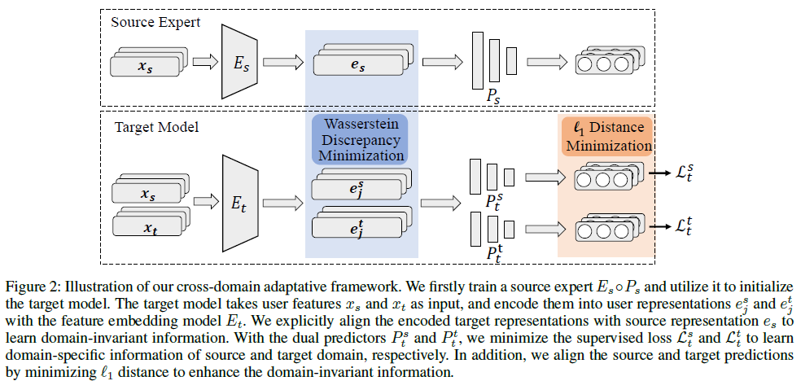

# Cross-domain Adaptative Learning for Online Advertisement Customer Lifetime Value Prediction

Hongzu Su, Zhekai Du, Jingjing Li, Lei Zhu, Ke Lu

Abstract: Accurate estimation of customer lifetime value (LTV), which reflects the potential consumption of a user over a period of time, is crucial for the revenue management of online advertising platforms. However, predicting LTV in real-world applications is not an easy task since the user consumption data is usually insufficient within a specific domain. To tackle this problem, we propose a novel cross-domain adaptative framework (CDAF) to leverage consumption data from different domains. The proposed method is able to simultaneously mitigate the data scarce problem and the distribution gap problem caused by data from different domains. To be specific, our method firstly learns a LTV prediction model from a different but related platform with sufficient data provision. Subsequently, we exploit domain-invariant information to mitigate data scarce problem by minimizing the Wasserstein discrepancy between the encoded user representations of two domains. In addition, we design a dual-predictor schema which not only enhances domain-invariant information in the semantic space but also preserves domain-specific information for accurate target prediction. The proposed framework is evaluated on five datasets collected from real historical data on the advertising platform of Tencent Games. Experimental results verify that the proposed framework is able to significantly improve the LTV prediction performance on this platform. For instance, our method can boost DCNv2 with the improvement of $13.7\%$ in terms of AUC on dataset G2.

# Environments
- python 3.8
- pytorch 1.13.1
- tensorflow 2.4 

# Acknowledgement
The structure of this code is largely based on the tensorflow implementation of [Sliced Wasserstein Discrepancy](https://github.com/apple/ml-cvpr2019-swd/blob/main/swd.py). Thanks for their work. 